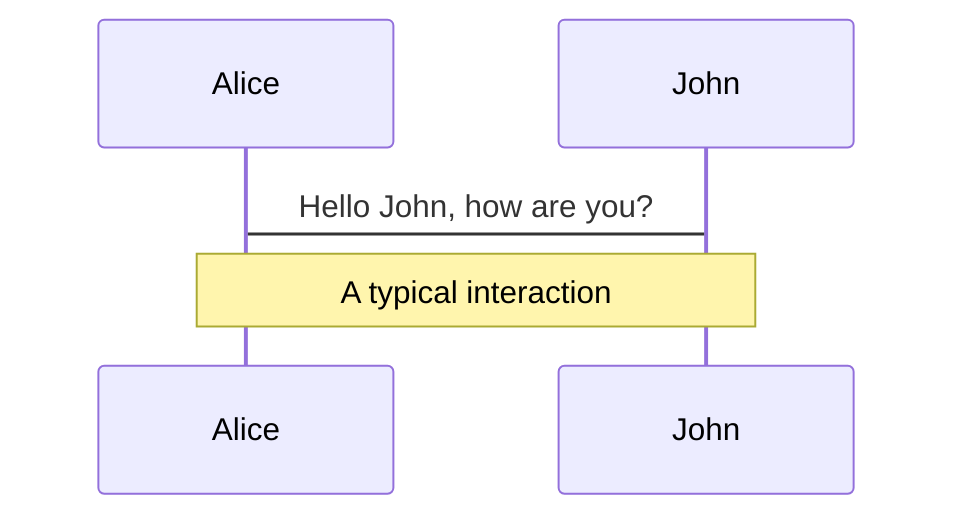
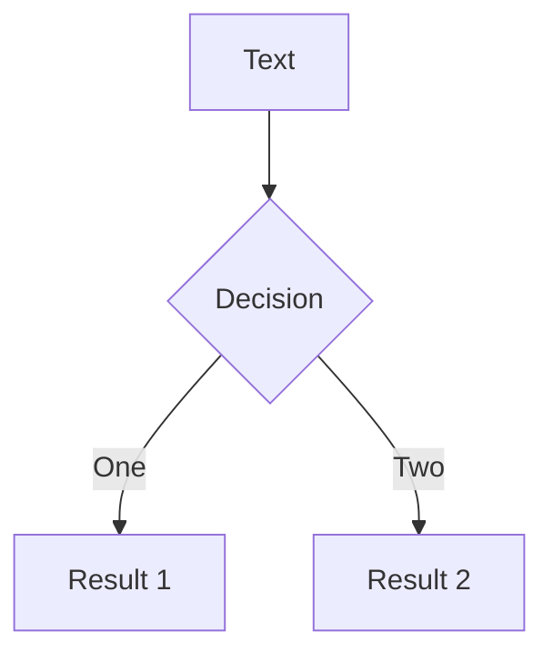

# Welcome to Slidev

<!--
コメント書く
-->
---

#

<div class="titles"><div class="titlecontent">

 <p class="center">EPISODE IV<br />A NEW HOPE FOR CSS3</p>

 <p>It is a period of vendor war.</p>

 <p>This is a demonstration of Star Wars-style scrolling 3D titles in CSS3. It possibly has no practical purpose whatsoever but it looks great and you can impress your friends.</p>

 <p>Before movie-buffs start ranting, I realize Star Wars wasn't the first to use crawling 3D titles, but few of you will remember the Flash Gordon series or the 1936 adaption of HG Wells' "Things to Come".</p>

 <p>Also, by mentioning "Star Wars", everyone will understand what I mean. And I'll receive several thousand more visits.</p>

 <p>The scrolling titles work well in Chrome, Safari and Firefox. Opera doesn't implement 3D transforms yet, but the text will scroll. IE users receive a blank page. A shame, but IE10 should support it.</p>

 <p>So how does it work? Well, it's fairly simple. We have an outer absolute DIV (#titles) which is rotated along the X-axis using perspective to give the impression of depth. The same DIV also has an :after psuedo-element which applies a linear gradient so the text appears to fade out.</p>

 <p>Inside, we have another absolutely-positioned DIV which contains the text (#titlecontent). The top is set to 100% to ensure it starts off-screen then uses CSS3 animation to move it upward over time. No JavaScript is required.</p>

 <p>You will probably need to adjust the movement amount and timing depending on the quantity of text you want to show. The 3D depth can also be tweaked in the</p>

 <p>All the code is contained in this single HTML file</p>

 <p class="center">View the source, Luke!</p>

 <p>Sorry. Couldn't resist it.</p>

 <p>You're welcome to use this demonstration code in your own sites. Please link back to the original article at:</p>

 <p class="center"><a href="http://www.sitepoint.com/css3-starwars-scrolling-text/">sitepoint.com/<br />css3-starwars-scrolling-text/</a></p>

 <p>and give me a shout on Twitter <a href="http://twitter.com/craigbuckler">@craigbuckler</a> &ndash; I'd love to see how you use and abuse it!</p>

 <p>Finally, Han shot first and the original, unadulterated movies remain the best. Stop fiddling with them, George!</p>

</div></div>

<style>
 .titles {
    position: absolute;
    width: 18em;
    height: 50em;
    bottom: 0;
    left: 50%;
    margin-left: -9em;
    font-size: 350%;
    font-weight: bold;
    text-align: justify;
    overflow: hidden;
    transform-origin: 50% 100%;
    transform: perspective(300px) rotateX(25deg);
 }
 .titles:after {
    position: absolute;
    content: ' ';
    left: 0;
    right: 0;
    top: 0;
    bottom: 60%;
    background-image: linear-gradient(top, rgba(0,0,0,1) 0%, transparent 100%);
    pointer-events: none;
 }
</style>
---

## 実体リソース


---

## 仮想リソース


---

## セキュリティ対策も追加


---

## dev環境のみの構成


---

# Navigation

Hover on the bottom-left corner to see the navigation's controls panel, [learn more](https://sli.dev/guide/navigation.html)

### Keyboard Shortcuts

|     |     |
| --- | --- |
| <kbd>right</kbd> / <kbd>space</kbd>| next animation or slide |
| <kbd>left</kbd>  / <kbd>shift</kbd><kbd>space</kbd> | previous animation or slide |
| <kbd>up</kbd> | previous slide |
| <kbd>down</kbd> | next slide |

<!-- https://sli.dev/guide/animations.html#click-animations -->

<p v-after class="absolute bottom-23 left-45 opacity-30 transform -rotate-10">Here!</p>

---

layout: image-right
image: <https://source.unsplash.com/collection/94734566/1920x1080>
---

# Code

Use code snippets and get the highlighting directly![^1]

```ts {all|2|1-6|9|all}
interface User {
  id: number
  firstName: string
  lastName: string
  role: string
}

function updateUser(id: number, update: User) {
  const user = getUser(id)
  const newUser = {...user, ...update}
  saveUser(id, newUser)
}
```

<arrow v-click="3" x1="400" y1="420" x2="230" y2="330" color="#564" width="3" arrowSize="1" />

[^1]: [Learn More](https://sli.dev/guide/syntax.html#line-highlighting)

<style>
.footnotes-sep {
  @apply mt-20 opacity-10;
}
.footnotes {
  @apply text-sm opacity-75;
}
.footnote-backref {
  display: none;
}
</style>

---

# Components

<div grid="~ cols-2 gap-4">
<div>

You can use Vue components directly inside your slides.

We have provided a few built-in components like `<Tweet/>` and `<Youtube/>` that you can use directly. And adding your custom components is also super easy.

```html
<Counter :count="10" />
```

<!-- ./components/Counter.vue -->
<Counter :count="10" m="t-4" />

Check out [the guides](https://sli.dev/builtin/components.html) for more.

</div>
<div>

```html
<Tweet id="1390115482657726468" />
```

<Tweet id="1390115482657726468" scale="0.65" />

</div>
</div>

---

# Themes

Slidev comes with powerful theming support. Themes can provide styles, layouts, components, or even configurations for tools. Switching between themes by just **one edit** in your frontmatter:

<div grid="~ cols-2 gap-2" m="-t-2">

```yaml
---
theme: default
---
```

```yaml
---
theme: seriph
---
```


</div>

Read more about [How to use a theme](https://sli.dev/themes/use.html) and
check out the [Awesome Themes Gallery](https://sli.dev/themes/gallery.html).

---

preload: false
---

# Animations

Animations are powered by [@vueuse/motion](https://motion.vueuse.org/).

```html
<div
  v-motion
  :initial="{ x: -80 }"
  :enter="{ x: 0 }">
  Slidev
</div>
```

<div class="w-60 relative mt-6">
  <div class="relative w-40 h-40">
    
    
    
  </div>

  <div
    class="text-5xl absolute top-14 left-40 text-[#2B90B6] -z-1"
    v-motion
    :initial="{ x: -80, opacity: 0}"
    :enter="{ x: 0, opacity: 1, transition: { delay: 2000, duration: 1000 } }">
    Slidev
  </div>
</div>

<!-- vue script setup scripts can be directly used in markdown, and will only affects current page -->
<script setup lang="ts">
const final = {
  x: 0,
  y: 0,
  rotate: 0,
  scale: 1,
  transition: {
    type: 'spring',
    damping: 10,
    stiffness: 20,
    mass: 2
  }
}
</script>

<div
  v-motion
  :initial="{ x:35, y: 40, opacity: 0}"
  :enter="{ y: 0, opacity: 1, transition: { delay: 3500 } }">

[Learn More](https://sli.dev/guide/animations.html#motion)

</div>

---

# LaTeX

LaTeX is supported out-of-box powered by [KaTeX](https://katex.org/).

<br>

Inline $\sqrt{3x-1}+(1+x)^2$

Block
$$
\begin{array}{c}

\nabla \times \vec{\mathbf{B}} -\, \frac1c\, \frac{\partial\vec{\mathbf{E}}}{\partial t} &
= \frac{4\pi}{c}\vec{\mathbf{j}}    \nabla \cdot \vec{\mathbf{E}} & = 4 \pi \rho \\

\nabla \times \vec{\mathbf{E}}\, +\, \frac1c\, \frac{\partial\vec{\mathbf{B}}}{\partial t} & = \vec{\mathbf{0}} \\

\nabla \cdot \vec{\mathbf{B}} & = 0

\end{array}
$$

<br>

[Learn more](https://sli.dev/guide/syntax#latex)

---

# Diagrams

You can create diagrams / graphs from textual descriptions, directly in your Markdown.

<div class="grid grid-cols-2 gap-10 pt-4 -mb-6">





</div>

[Learn More](https://sli.dev/guide/syntax.html#diagrams)

---

layout: center
class: text-center
---

# Learn More

[Documentations](https://sli.dev) · [GitHub](https://github.com/slidevjs/slidev) · [Showcases](https://sli.dev/showcases.html)
